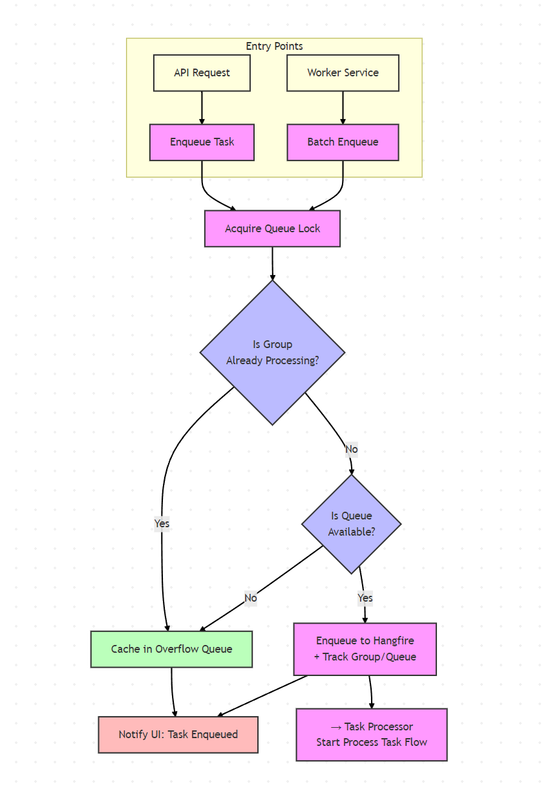
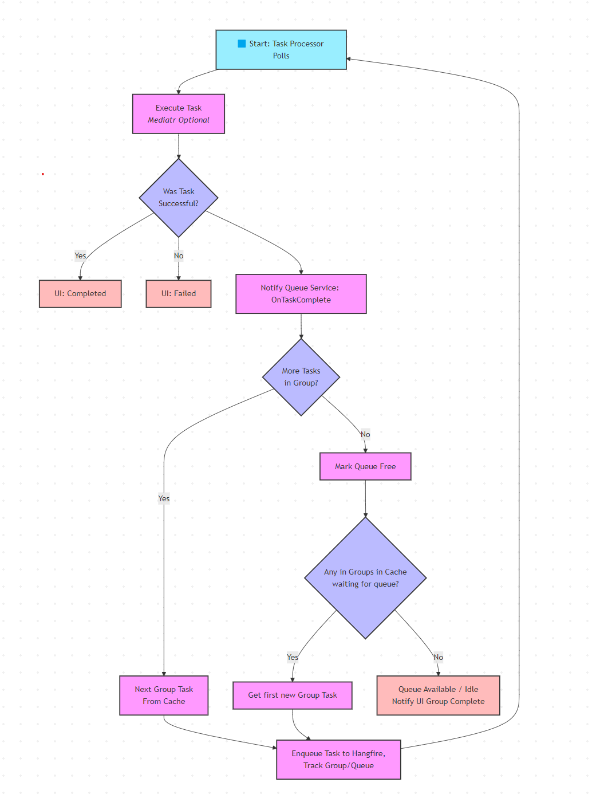

# 🧠 Parallel Sequential Task Processor

A sample project demonstrating how to achieve **parallel sequential task processing** using Hangfire — a system that allows tasks to run concurrently across groups, while strictly enforcing sequential execution within each group.

---

## 📸 Screenshots

> _Coming Soon
> 
---

## 🌐 Live Demo

> _Coming Soon 

---

## ✨ Features

- Dynamically assigns tasks to queues based on shared group keys (e.g. `IntegrationId`)
- Ensures **only one task per group is running at a time**
- Seamlessly supports tasks triggered both by the backend or from the UI
- Overflow handling for queued-up tasks when a group is already processing
- Background queue freeing and UI task state updates
- Built on top of Hangfire, but fully custom queueing logic

---

## 🧰 Tech Stack

- **Frontend:** Vue 3 + Vuetify
- **Backend:** ASP.NET Core (C#)
- **Task Processing:** Hangfire
- **Architecture:** Clean Architecture principles with CQRS via MediatR

---

## 💡 Problem & Solution

### The Problem

In a real-world project, we needed to process a large number of internal synchronization tasks. These tasks could be initiated either:

- From a **background service**, or
- From a **frontend UI trigger**

This introduced **race conditions** and **conflicts**, especially when tasks were targeting the same logical group (e.g., same database entity or integration). The constraint was clear:

> **All tasks that share a group must be processed in strict order (sequentially), but tasks from different groups must run concurrently.**

Unfortunately, Hangfire doesn't natively support this kind of **"parallel sequential processing"** — its built-in queues are static and do not enforce grouping constraints.

---

### The Solution

To solve this, I built a **custom queueing system**, layered on top of Hangfire. Here's how it works:

- 🔁 **Dynamic Queues**: At runtime, tasks are assigned to dynamic Hangfire queues based on a unique `GroupId` (e.g., `IntegrationId`)
- 🧮 **Queue Tracking**: Each queue only ever has **one active Hangfire task** at a time
- 📦 **Task Caching**: Additional tasks for a group are **stored in memory** (in a queue service), not immediately enqueued to Hangfire
- 🔚 **On Completion**: Once the current Hangfire job finishes, the queue service checks:
  - If more tasks exist in the group → enqueue the next
  - If not → check the overflow list for pending group tasks and assign an available queue

This model allows each group to maintain **strict sequential order**, while letting other groups process in **parallel**, all in a dynamic and scalable manner.

---

## 🧭 Diagrams

### 1. Enqueue Flow

Shows how tasks are routed into queues depending on whether a group is already being processed.

### 2. Task Processor Flow

Illustrates how each task is processed one-by-one within a group, and how the queue transitions upon completion.

---

